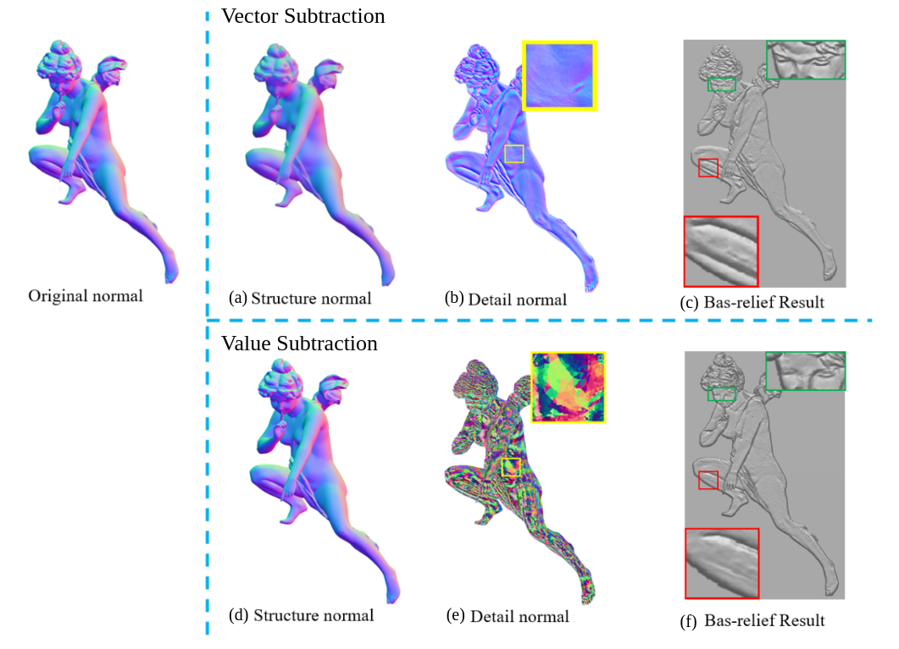

# Decomposition-for-Normal-Images
This repo presents a Matlab program implemented to decompose a normal image into a structure normal image and a detail normal image, where a structure normal image contains the main structure information from the original normal image (obtained by applying DTRF smoothing filter), and a detail normal image contains the detail information from the original normal image.

  

## Introduction
Normal Decomposition is mainly used for manipulating normal information stored in normal images, where normal images are more like a 2.5D data, a bridge that CONNECTs 3D information and 2D images. Thus, geometry processing applications especially 3D bas-relief modelling is naturally appealing to use such images to reconstruct 3D infromation. However, bas-relief modelling generally has to cope with compression cases, thus it is an essential capability for such application to preserve geometry details well under compression circumstances.

People dealing with geometry detail preservation, in general, consider to decompose details from normal images first, then manipulate them before reconstruction. However, detail information obtained by value subtraction is broken (see zoom-in details of \(e\) in Fig 1.), where value subtraction is operated on pixel-level from original normal images and smoothed normal images. In fact, the detail information should be a vector subtraction as the RGB colour of each pixel in a normal image represents a vector. Therefore, to obtain more correct and intact detail information, we should use vector subtraction instead of value subtraction. 

## Script in Matlab
[Here]() is a script written in Matlab to decompose normal based on vector subtraction. Additionally, the script also includes a smoothing function that applies DTRF filter to obtain a structure normal image by smoothing the origial normal image.

The equation for the vector subtraction is:
$$n1 - n2 = quaternion(n2,n0).*N1.*quaternion(n2,n0)^{-1}$$
where $N1=(0, n1)$, $n0=(0,0,1)$ a constant vector, and $quaternion(n2,n0)$ and $quaternion(n2,n0)^{-1}$ represent the quaternion and inverse_quaternion calculated from the rotation matrix that rotates vector $n2$ to vector $n0$ via z-axis. 

## Run example
run the script called "run.m" in Matlab, then you should find the decomposed results in path "./data/"

## Results
Here is a comparsion between detail information (see \(b\) and \(d\) in Fig 1.) and reconstruction results (see \(c\) and \(f\) in Fig 1.) between value subtraction and vector subtraction.
